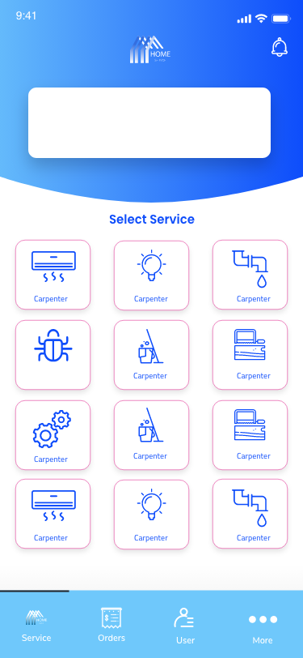
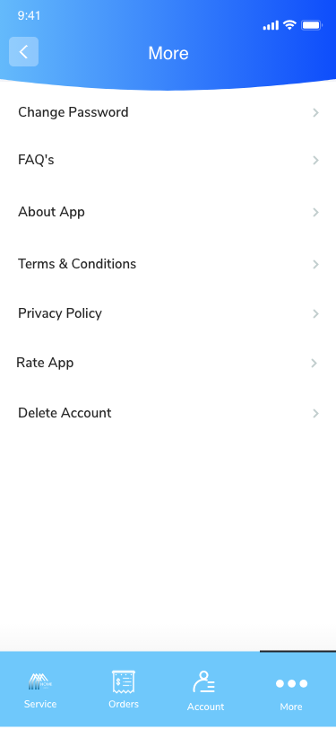
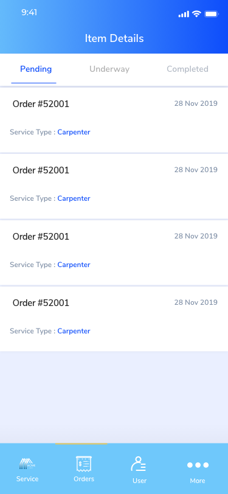
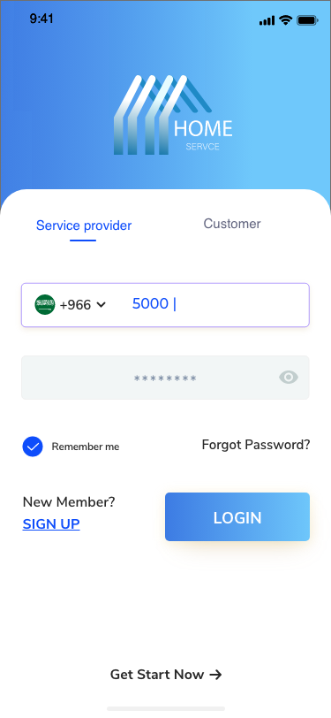
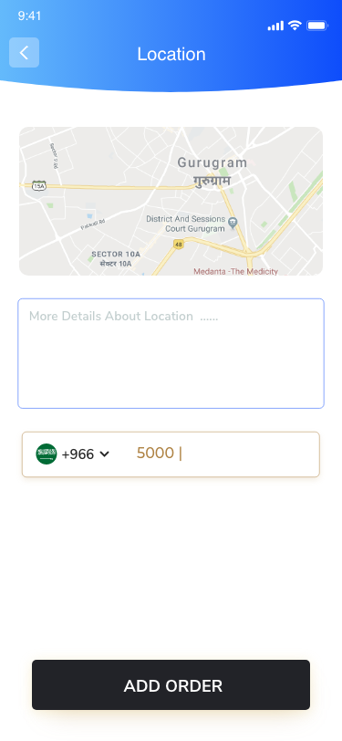
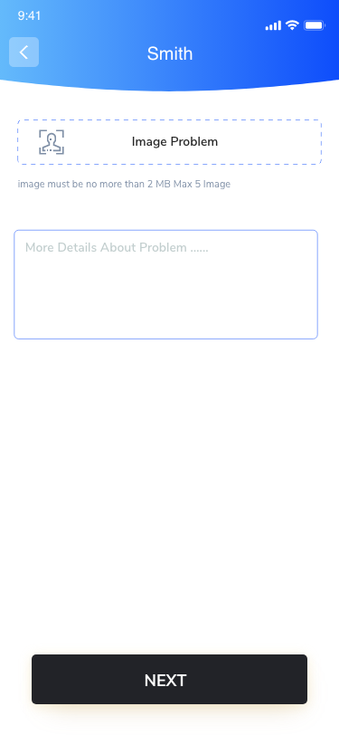

# Services Marketplace App (Kotlin Native) 🛠️

A native Android application built with **Jetpack Compose** and **MVVM**. The app provides a complete marketplace for services, including order tracking and REST API integration.

## ✨ Tech Stack & Features
- **UI:** Jetpack Compose (Modern Declarative UI).
- **Architecture:** MVVM (Model-View-ViewModel).
- **Networking:** Retrofit & GSON for API handling.
- **Order Flow:** Full cycle from service selection to status tracking (Pending/Completed).

---

## 📸 Screenshots

  
  
  
  

  
<b>🔍 View More Screenshots (Click to expand)</b>

  

    
    
    
    
     
    
    
    
    
  

---

## 🛠️ Installation
1. Clone the repo.
2. Open in Android Studio.
3. Sync Gradle and Run.
